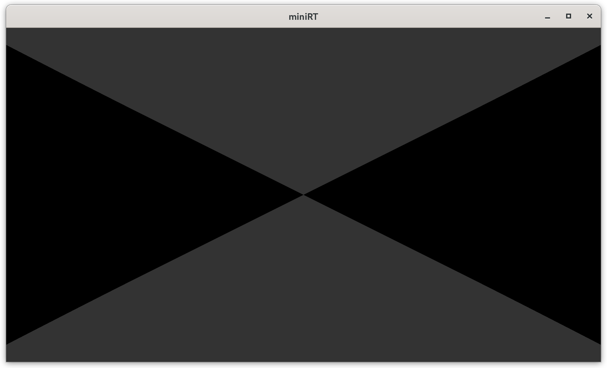
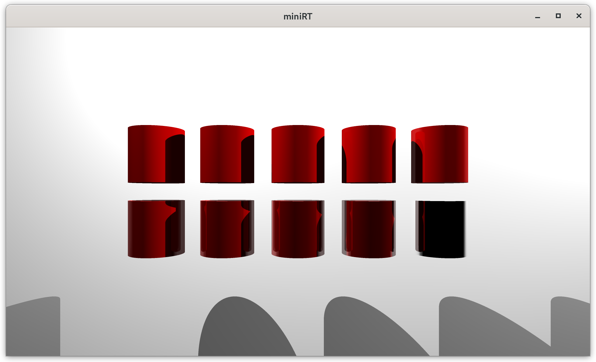

# MiniRT Project: A Ray-Tracing Engine

Welcome to the **mini rt** project! This is a compact yet powerful ray-tracing engine developed from scratch in C. Its purpose is to render realistic 3D scenes by simulating the path of light. The project manages geometric shapes, lighting, and advanced rendering techniques to create high-quality images.

---
## How to Run

To get and run the `minirt` program, follow these steps:

First, clone the repository using `git`:

```bash
  git clone [https://github.com/rogerdevworld/minirt.git](https://github.com/rogerdevworld/minirt.git)
````

Once the repository is downloaded, navigate to the project folder. C projects are typically compiled with the `make` tool.

```bash
  cd minirt
  make
```

After the compilation is successful, you can run the program with the `./miniRT` command followed by the scene file (`.rt`) you want to render. You can find several example scene files in the `scene/` directory.

For example, to render the basic scene, you would use the following command:

```bash
./miniRT scene/basic.rt
```

-----

## Scene Files

Scene files are plain text files that define the elements of a 3D scene, such as the camera, lights, and objects. The project includes a variety of examples to test different features.

## 🖼️ Example Scenes

### **Basic Shape Scenes**
These scenes are ideal for testing the rendering of individual shapes with basic lighting and camera settings.

- **`cone.rt`** → Renders a simple cone.  
  

- **`cylinder.rt`** → Displays a simple cylinder.  
  

- **`hyperboloid.rt`** → Contains a hyperboloid, one of the more complex conic shapes.  
  

- **`paraboloide.rt`** → Presents a paraboloid.  
  

- **`plane.rt`** → Renders a plane, useful for checking lighting and shadows.  
  

- **`sphere.rt`** → The most basic and essential scene for testing lighting and shadows on a round shape.  
  

---

### **Advanced Material Scenes**
These scenes focus on testing advanced material properties like **mirror (`mir`)** and **specular (`spc`)** reflections.

- **`sphere_mir.rt`** → Contains a sphere with **mirror** properties.  
  

- **`cone_mir.rt`** → Cone with **mirror** reflection.  
  

- **`cylinder_mir.rt`** → Cylinder with **mirror** reflection.  
  

- **`parabolid_mir.rt`** → Paraboloid with **mirror** reflection.  
  

- **`hyperbolid_mir.rt`** → Hyperboloid with **mirror** reflection.  
  

- **`sphere_spc.rt`** → Shows a sphere with high **specular reflection**.  
  

- **`cone_spc.rt`** → Cone with **specular** highlights.  
  

- **`cylinder_spc.rt`** → Cylinder with **specular** reflection.  
  

- **`parabolid_spc.rt`** → Paraboloid with **specular** properties.  
  

---

### **Complex and Textured Scenes**
These scenes combine multiple objects, lights, and textures to create detailed environments.

- **`basic.rt`** → A starter scene with one or two basic shapes and simple lighting.  
  

- **`bonus_basic.rt`** → A version of the basic scene with extra features.  
  

- **`ladrillo.rt`** → Applies a **brick texture** to an object.  
  

- **`map.rt`** → A complex test map combining multiple shapes and textures.  
  

- **`rock.rt`** → Uses a **rock texture** on a shape.  
  

- **`special/room.rt`** → A full **room** scenario to test light and shadow interaction in a closed space.  
  

- **`tink.rt`** → A scene using the **Tink** 3D model to test handling complex polygonal models.  
  

- **`water.rt`** → A surface with a **water texture**, including refraction or reflection effects.  
  

- **`mir.rt`** → A global scene showcasing multiple mirrored objects.  
  

- **`spc.rt`** → Scene showcasing multiple specular highlights.  
  


-----

## Parsing

The parsing process is the phase where your program reads, interprets, and validates the `.rt` configuration file to construct the 3D scene in memory. This file acts as a script that tells your rendering engine what elements, lights, and objects to generate and where to place them.

### **The `.rt` Configuration File**

The `.rt` file is a plain text format designed to be readable and easy to edit. Each line of the file represents a specific scene element, such as a camera, a light, or an object. The general structure is:

`[Identifier] [Property 1] [Property 2] ... [Modifiers]`

  * **Identifier**: A letter or a set of letters that defines the type of element (`C` for Camera, `sp` for Sphere, `pl` for Plane, etc.).
  * **Properties**: Numerical values (positions, colors, brightness) that define the characteristics of the element.
  * **Modifiers (Optional)**: Key-value pairs that add special properties to an object, such as reflection or specular color.

### **The Parsing Process**

The program performs a series of sequential steps to process the `.rt` file and populate the scene's data structures.

1.  **File Reading**: The program opens the `.rt` file and reads it line by line.
2.  **Tokenization**: Each line is divided into "tokens" (or words) using a delimiter, such as a space. The first token is always the element identifier.
3.  **Data Validation and Conversion**: Tokens that represent numbers or colors are converted from text to numerical data types (`double` for positions and `int` for colors). During this process, validations are performed to ensure that the values are correct (for example, color components must be between 0 and 255, and orientation vectors must be normalized). If a value is not valid, the program throws an error.
4.  **Structure Creation**: Once the data from a line has been validated, it is used to create a C structure (e.g., `t_camera`, `t_light`, or `t_object`) and added to a list representing the scene.

### **Special Modifiers (`mir`, `spc`, `chk`)**

Your scene file includes optional modifiers that add advanced material properties to objects.

  * `mir` (Mirror): Defines the surface's reflectivity. A value of `mir:0.0` has no reflection, while `mir:1.0` is a perfect mirror. This allows simulating surfaces like metals or glass.
  * `spc` (Specularity): Controls the size and intensity of light reflections on the surface. A higher value creates a smaller, more concentrated highlight, typical of polished plastics or metals.
  * `chk` (Checkerboard): Applies a checkerboard pattern to the object's surface, using two alternating colors.

### **Example of Parsing with Modifiers**

Consider the following line from your file: `sp -10,4,0 1.5 255,0,0 mir:0.3`

1.  The parser reads the entire line.
2.  It splits it into tokens: `["sp", "-10,4,0", "1.5", "255,0,0", "mir:0.3"]`.
3.  It recognizes "sp" and invokes the sphere parsing function.
4.  It parses the first three tokens as the position, diameter, and color, respectively.
5.  Upon reaching the last token, it detects the **`mir`** key and the **`0.3`** value.
6.  The sphere parsing function uses this value to set the sphere's reflectivity property in its material structure.

-----

## Project Structure and Key Concepts

The engine is based on a modular design, where each component handles a specific aspect of the rendering process. Key concepts include:

  * **Vectors and Geometry**: The project uses a robust set of mathematical functions for vectors (`vec3_init`, `vec3_add`, `vec3_mul`, etc.) for all geometric calculations. Objects like spheres, planes, and cylinders are defined by their position, orientation, and other properties.
  * **Ray Tracing**: The core principle is to cast rays from the camera's position through each pixel of the virtual screen to determine the color of the nearest object hit. The code includes functions to manage the scene dynamically, allowing for the addition and freeing of objects and lights from memory.

### **Vector Structures and Functions**

The `mini rt` project uses specific structures for 3D and 2D vectors, which are the foundation of all geometric operations. These structures are defined as follows:

  * **`t_vec3`**: Represents a vector or a point in 3D space.
    ```c
    typedef struct s_vec3
    {
        double x;
        double y;
        double z;
    } t_vec3;
    ```
  * **`t_vec2`**: Represents a vector or coordinate in 2D space, often used for texture mapping.
    ```c
    typedef struct s_vec2
    {
        double u;
        double v;
    } t_vec2;
    ```

The project includes essential vector functions that perform core mathematical operations:

  * **`vec3_init`**: Initializes a vector with specific values.
  * **`vec3_normalize`**: **Normalizes** a vector so its length becomes 1. This is crucial for ray directions and surface normals.
  * **`vec3_sub`**: Subtracts one vector from another.
  * **`vec3_mul`**: Multiplies a vector by a scalar.
  * **`vec3_cross`**: Calculates the **cross product** between two vectors, essential for finding perpendicular vectors (e.g., for camera orientation).
  * **`vec3_dot`**: Calculates the **dot product** between two vectors. This is a fundamental operation for lighting and shadows, as it determines the angle between two vectors.
  * **`vec3_reflect`**: Calculates the reflection vector, used to simulate perfect mirror surfaces.

-----

## Mathematical Functions and Algebra

From a developer's perspective, the `mini rt` project is a fascinating exercise in applied mathematics. It relies on linear algebra and trigonometry to simulate the physics of light and 3D geometry.

### **Use of the `math` Library**

The project relies on the standard `math.h` library for complex calculations.

  * **`sin` and `cos`**: Essential for vector rotation and camera manipulation.
  * **`tan`**: The tangent function is used to define how rays are projected onto the camera's image plane. The formula `2.0 * tan(fov_rad / 2.0)` connects the field of view angle to the image plane size.
  * **`atan` and `atan2`**: The `atan2` function is particularly useful for **UV mapping** on curved surfaces like spheres. It converts a 3D point's Cartesian coordinates into angular coordinates (`u`, `v`) for texture lookups.
  * **`M_PI`**: This constant (π) is used for converting angles between degrees and radians and in any calculations involving circles or spheres.

### **Intersection Formulas**

Determining if and where a ray intersects an object is the most critical part of a ray tracer. This is done by solving mathematical equations:

  * **Ray-Sphere Intersection**: A ray is defined by `P(t) = O + tD` (origin + direction \* distance), and a sphere by `(P - C) · (P - C) = r²` (point on sphere - center dot product with itself = radius squared). Substituting the ray equation into the sphere equation results in a **quadratic equation (`at² + bt + c = 0`)**. The solutions for `t` indicate whether there is an intersection.
  * **Ray-Plane Intersection**: A plane is defined by a point and a normal vector. The intersection is found by solving a simpler **linear equation**, which gives the distance to the intersection point.

-----

## Quality Enhancements and Optimizations

For high-quality rendering, the project employs several advanced techniques.

### **Parallel Processing (Multithreading)**

The project uses **Pthreads** to distribute the rendering workload across multiple CPU cores. The image is divided into rows, and blocks of rows are assigned to each thread. This significantly speeds up the image generation, especially for complex scenes. A **mutex** is used to safely manage shared data, preventing synchronization errors.

  * **`render_thread_func`**: This is the main function each thread executes independently. Its job is to iterate through a specific section of image rows, render each pixel, and update the rendering progress.
  * **`create_and_run_threads`**: This function orchestrates the creation of threads. It determines how many threads to create, calculates the number of rows each thread should process, and then uses `pthread_create` to launch each thread.

### **Subpixel Anti-Aliasing**

Also known as **supersampling**, this technique improves image quality by smoothing jagged edges. Instead of casting a single ray per pixel, the program casts multiple "sub-rays" within each pixel and averages their colors.

  * **`generate_antialiased_ray`**: This function generates a ray for a specific subpixel, including an `offset` that precisely positions the ray.
  * **`render_pixel`**: This function iterates over all the subpixels within a single pixel, sums their colors, and then averages the result to get the final pixel color.

-----

## Texture and Normal Mapping

Texture and normal mapping are crucial for creating a realistic appearance without adding geometric complexity. Your project handles these concepts through specific data structures and functions.

### **Texture Mapping (UV Mapping)**

The process of UV mapping projects a 2D image (texture) onto a 3D surface. Each point of a ray's intersection with an object is assigned a **UV coordinate (`(u, v)`)** that corresponds to a point on the texture.

  * **`t_material`**: This structure contains fields like `has_texture` and `has_normal_map` and pointers to texture images, allowing the rendering engine to know if it should use a texture file instead of the object's default color.
  * **UV Coordinate Functions**: The code includes dedicated functions like `get_uv_sphere`, `get_uv_plane`, and `get_uv_cylinder` to calculate UV coordinates for each geometric shape.

For a **sphere**, UV mapping uses polar coordinates to unwrap the surface. For a **plane**, it is the simplest, as it is a 2D surface already. For a **cylinder**, it is a combination: one method for the side and another for the top and bottom caps.

### **Normal Mapping**

**Normal mapping** uses a special texture (the normal map) to alter the direction of a surface's normals. This creates the illusion of surface details like bumps or cracks without adding more polygons to the geometry. Your project implements this logic to enhance visual detail efficiently.

  * **`get_effective_normal()`**: This function likely determines the final normal to be used for lighting calculations. It checks if the object has a normal map; if so, it reads the vector from the map, normalizes it, and transforms it to the scene's space to replace the geometric normal. If not, it uses the standard geometric normal.
  * **Lighting Calculations**: The effective normal is then used in functions like `calculate_diffuse_light` and `calculate_specular` to compute the amount of light received and to create specular highlights, making the object look more realistic.

The file structure of your project supports this by organizing textures with a naming convention like `_color.png` and `_normal.png`, allowing the engine to correctly associate the two maps for a single object.

```
scene/
├── maps/
│   ├── figures/
│   ├── mir/
│   └── spc/
└── texture/
     ├── ladrillo_color.png
     └── ladrillo_normal.png
```

This structure reflects the project's logic, where textures are stored separately from scenes and are organized into color and normal maps.

```
```